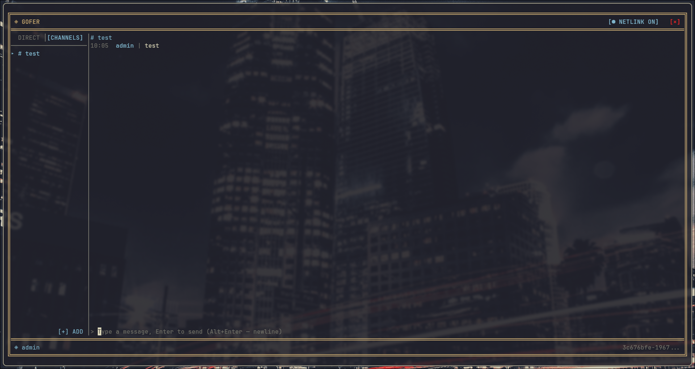
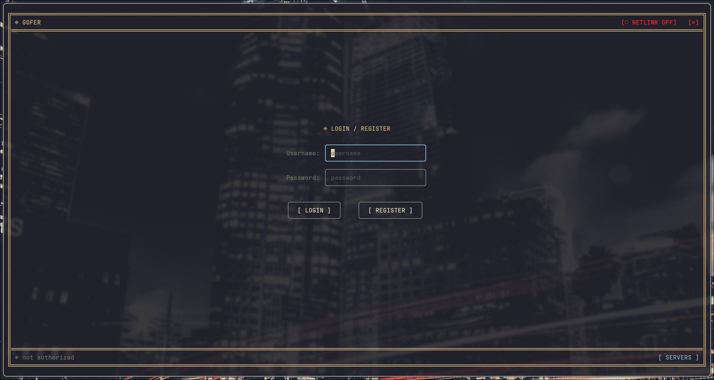
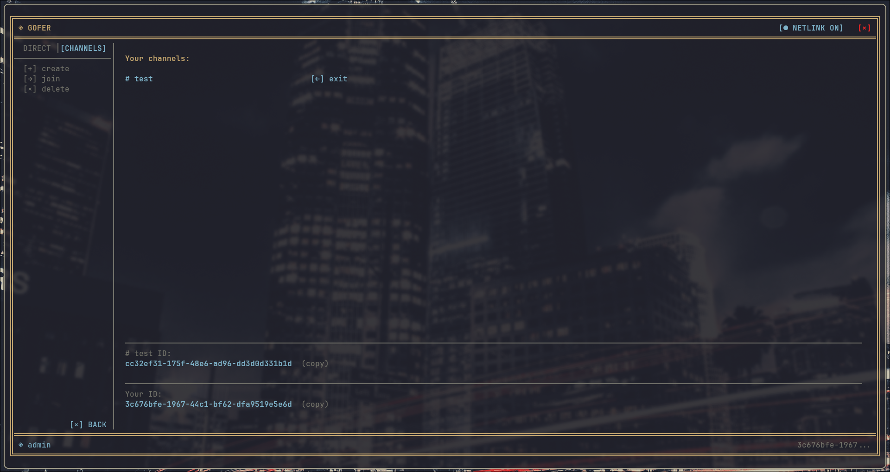
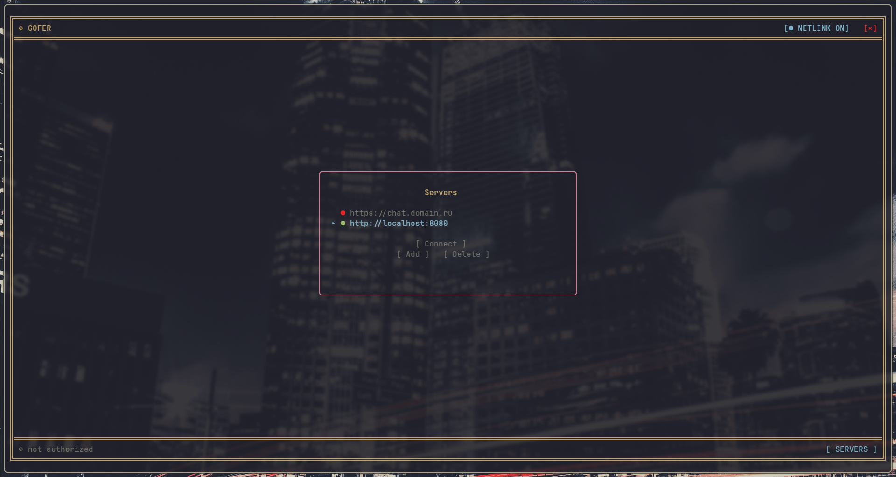
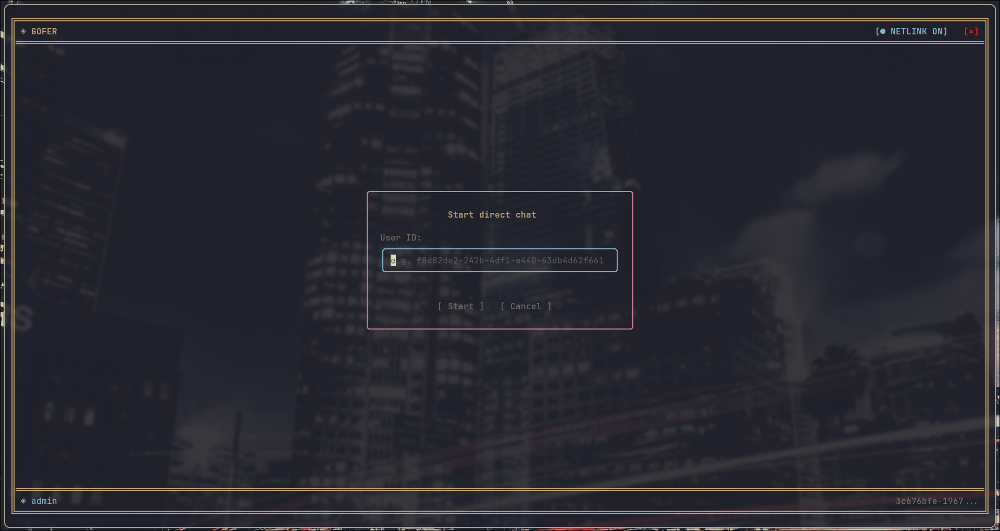

# Gofer

> A console messenger in Go: group channels and direct messages in real time, all inside the terminal.

[](README.md) 

   

<!-- ABOUT -->
<h2 align="left">💬 About</h2>

<table>
<tr>
<td valign="top" width="55%">

**Gofer** is a console client-server messenger.

- **Language:** [**`Go 1.26`**](https://go.dev/)
- **Database:** [**`PostgreSQL 16`**](https://www.postgresql.org/) in Docker
- **Realtime:** [**`WebSocket`**](https://github.com/gorilla/websocket)
- **Auth:** [**`JWT`**](https://github.com/golang-jwt/jwt) — access + refresh tokens
- **Interface:** [**`Bubble Tea`**](https://github.com/charmbracelet/bubbletea) — TUI interface
- **Architecture:** Clean Architecture, 4 layers

Two binaries: a **server** (HTTP + WebSocket + Postgres) and a **TUI client**.

</td>
<td valign="top" width="45%">



</td>
</tr>
</table>

<!-- GALLERY -->
<a name="Gallery"></a>
<h2 align="center">🖼️ Gallery</h2>

<table>
<tr>
<td align="center" width="50%">
  <br>
  <b>Login / Register</b>
</td>
<td align="center" width="50%">
  <br>
  <b>Channels</b>
</td>
</tr>
<tr>
<td align="center" width="50%">
  <br>
  <b>Server picker</b>
</td>
<td align="center" width="50%">
  <br>
  <b>Action confirmation</b>
</td>
</tr>
</table>

<!-- TABLE OF CONTENTS -->
<a name="Table-of-Contents"></a>

## 📚 Table of Contents

+ [Features](#Features)
+ [Requirements](#Requirements)
+ [Installation & Running](#Installation)
  + [Scenario A — everything on one machine](#Local)
  + [Scenario B — server on a remote machine](#Remote)
  + [Building binaries](#Build)
+ [Configuration](#Configuration)
+ [Tech stack](#Stack)

---

<!-- FEATURES -->
<a name="Features"></a>
<h2 align="center">🚀 Features</h2>

- **JWT authentication** — registration and login, an access token (15 minutes) + a refresh token (7 days). The token is refreshed automatically when the WebSocket connection drops.
- **Channels (group chats)** — create, join by ID, leave, delete (creator only), message history.
- **Direct messages (DM)** — start a conversation by user ID, delete, history. DM creation and deletion reach the other person instantly over WebSocket.
- **Real-time messaging** — delivery over WebSocket with write acknowledgement (ack) and protection against duplicates on retry.
- **User search** — by user ID.
- **In-client server picker** — the server list is stored locally; switch between servers and check availability (`●` online / offline) right from the TUI, no rebuild needed.
- **Terminal interface** — mouse and keyboard navigation, connection indicator, copying IDs to the clipboard, colored names in chat.
- **Graceful shutdown** — the server closes connections cleanly on a signal.

[⬆ Back to top](#Table-of-Contents)

---

<!-- REQUIREMENTS -->
<a name="Requirements"></a>
<h2 align="center">🧰 Requirements</h2>

You will need:

- **Go 1.26+** — [install](https://go.dev/doc/install)
- **Docker** (with Docker Compose) — for PostgreSQL
- **golang-migrate CLI** — the database migration tool. Installed separately, it is not among the project's dependencies:

```bash
go install -tags 'postgres' github.com/golang-migrate/migrate/v4/cmd/migrate@latest
```

> 💡 The `migrate` binary must end up in your `PATH` (usually `~/go/bin`). Check with: `migrate -version`.

- **A clipboard backend** (optional, Linux only) — for copying IDs: `xclip`, `xsel` or `wl-copy`. Everything works without them except copying.

[⬆ Back to top](#Table-of-Contents)

---

<!-- INSTALLATION -->
<a name="Installation"></a>
<h2 align="center">⚡ Installation & Running</h2>

Clone the repository:

```bash
# HTTPS
git clone https://github.com/MrTrigraf/Gofer.git

# or SSH
git clone git@github.com:MrTrigraf/Gofer.git

cd Gofer
```

<a name="Local"></a>
### Scenario A — everything on one machine

The simplest path: server, database and client on the same computer. All commands use the defaults from the `Makefile`.

**1. Start PostgreSQL in Docker:**

```bash
make docker
```

This starts the `gofer_db` container (PostgreSQL 16) on port `5432`.

**2. Create the server config:**

```bash
cp config/config.yaml.example config/config.yaml
```

Open `config/config.yaml` and **be sure to change the JWT secrets** (`jwt.secret` and `jwt.refresh`) to your own random strings. The other defaults match `docker-compose.yml` and don't need to be changed.

**3. Apply the database migrations:**

```bash
make migrate-up
```

This creates the tables: users, channels, members, direct chats, messages.

**4. Start the server:**

```bash
make run-server
```

The server comes up on `http://localhost:8080`.

**5. In another terminal, start the client:**

```bash
make run-client
```

The TUI opens. On the first launch the server list is empty — press the **`[ SERVERS ]`** button at the bottom of the screen, add the address `http://localhost:8080`, select it, and you can register.

<a name="Remote"></a>
### Scenario B — server on a remote machine

The server is deployed on any machine (a VPS, a home server), and clients connect to it over the network.

**On the server:**

1. Install Go, bring up PostgreSQL (via `make docker` or separately).
2. Build the server binary (see [Building](#Build)) or run it with `go run ./cmd/server`.
3. The server reads its config from the relative path `config/config.yaml`. If the binary lives elsewhere, pass the path explicitly with a flag:

```bash
./gofer-server --config /etc/gofer/config.yaml
```

4. Apply the migrations, pointing the connection string at the remote database (see the `Makefile`, the `migrate-up` target).
5. Open the server port (`8080` by default) to the outside. For production it's recommended to put a reverse proxy (nginx/Caddy) with TLS in front of the server — the client supports `https`/`wss`.

**On the client:**

1. Start the client (`make run-client` or the built binary).
2. Press **`[ SERVERS ]`** → **Add** → enter the server address:
   - `http://your-server.com:8080` — a plain connection;
   - `https://your-server.com` — if the server sits behind a TLS proxy (WebSocket switches to `wss` on its own).
3. Select the server in the list (`●` shows whether it's reachable) and connect.

> 💡 The server address is no longer hardcoded — the client stores its server list in `~/.config/gofer/servers.json` and lets you switch between them right from the interface.

<a name="Build"></a>
### Building binaries

Build both binaries for the current system:

```bash
go build -o gofer-server ./cmd/server
go build -o gofer-client ./cmd/client
```

Cross-compilation for another OS/architecture (Go does this out of the box):

```bash
# Linux (amd64)
GOOS=linux   GOARCH=amd64 go build -o gofer-server-linux   ./cmd/server

# Windows
GOOS=windows GOARCH=amd64 go build -o gofer-client.exe     ./cmd/client

# macOS (Apple Silicon)
GOOS=darwin  GOARCH=arm64 go build -o gofer-client-macos   ./cmd/client
```

> 💡 The `config/` folder with `config.yaml` must sit next to the server binary, or the config path must be given via the `--config` flag.

[⬆ Back to top](#Table-of-Contents)

---

<!-- CONFIGURATION -->
<a name="Configuration"></a>
<h2 align="center">⚙️ Configuration</h2>

The server is configured through `config/config.yaml`. The template is `config/config.yaml.example`.

```yaml
server:
  port: "8080"              # HTTP + WebSocket port

database:
  host: "localhost"
  port: "5432"
  user: "gofer"
  password: "gofer"
  name: "gofer"
  sslmode: "disable"
  max_conns: 25             # connection pool size
  min_conns: 5
  max_conn_lifetime: "5m"
  max_conn_idle_time: "2m"
  health_check_period: "1m"

jwt:
  secret: "your-secret-key"   # ⚠ change to your own random string
  refresh: "your-refresh-key" # ⚠ change to your own random string
  access_ttl: "15m"           # access token lifetime
  refresh_ttl: "168h"         # refresh token lifetime (7 days)
```

> ⚠️ **Never commit `config/config.yaml` with real secrets.** Only the `.example` file should live in the repository.

The client needs no config of its own — the server list is stored in `~/.config/gofer/servers.json` and filled in through the interface.

[⬆ Back to top](#Table-of-Contents)

---

<!-- STACK -->
<a name="Stack"></a>
<h2 align="center">📦 Tech stack</h2>

<details>
<summary><b>Server</b></summary>

- [`jackc/pgx/v5`](https://github.com/jackc/pgx) — PostgreSQL driver and connection pool
- [`gorilla/websocket`](https://github.com/gorilla/websocket) — WebSocket
- [`golang-jwt/jwt/v5`](https://github.com/golang-jwt/jwt) — JWT tokens
- [`golang.org/x/crypto/bcrypt`](https://pkg.go.dev/golang.org/x/crypto/bcrypt) — password hashing
- [`goccy/go-yaml`](https://github.com/goccy/go-yaml) — config parsing
- [`google/uuid`](https://github.com/google/uuid) — UUIDs
- `net/http` — standard router (Go 1.22+)
- `log/slog` — structured logging

</details>

<details>
<summary><b>Client (TUI)</b></summary>

- [`charmbracelet/bubbletea`](https://github.com/charmbracelet/bubbletea) — TUI framework (the Elm architecture)
- [`charmbracelet/lipgloss`](https://github.com/charmbracelet/lipgloss) — terminal styling and layout
- [`charmbracelet/bubbles`](https://github.com/charmbracelet/bubbles) — ready-made components (text inputs, viewport)
- [`gorilla/websocket`](https://github.com/gorilla/websocket) — WebSocket client
- [`atotto/clipboard`](https://github.com/atotto/clipboard) — clipboard access

</details>

<details>
<summary><b>Infrastructure</b></summary>

- [`PostgreSQL 16`](https://www.postgresql.org/) — database
- [`Docker Compose`](https://docs.docker.com/compose/) — running the database
- [`golang-migrate`](https://github.com/golang-migrate/migrate) — schema migrations

</details>

[⬆ Back to top](#Table-of-Contents)
